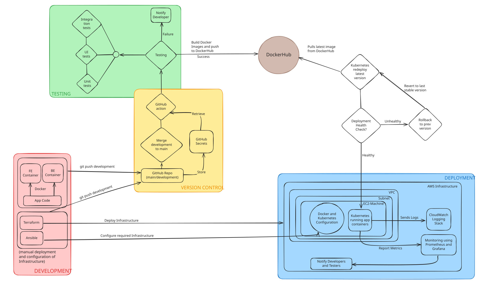

## TODO-APP

Building and Deploying a Next.js/Express To-Do Application with Automated CI/CD.

A comprehensive CI/CD (Continuous Integration/Continuous Deployment) pipeline, which manages the entire software lifecycle from development through testing to deployment and monitoring.

The CI/CD pipeline consists of four main components:

1. **Development** (Red) - Where code is created and prepared
2. **Version Control** (Yellow) - Where code is managed and tracked
3. **Testing** (Green) - Where code quality is validated
4. **Deployment** (Blue) - Where code is delivered to production environments

## 1. Development Environment

The development phase occurs in containerized environments to ensure consistency:

- **App Code**: The core application source code
- **FE Container**: Frontend container for UI development
- **BE Container**: Backend container for server-side development
- **Docker**: Container platform that encapsulates the application components
- **Terraform & Ansible**: Infrastructure as Code (IaC) tools used for manual deployment and configuration of infrastructure

## 2. Version Control

Our version control system uses GitHub for source management:

- **GitHub Repo**: The central repository with main and development branches
- **Git Push Development**: Developers push code to the development branch
- **GitHub Actions**: Triggered automatically when code is pushed
- **GitHub Secrets**: Secure storage for sensitive credentials and configuration
- **Merge Development to Main**: Code integration process when features are complete

All code changes are tracked, enabling collaboration and providing a full history of modifications.

## 3. Testing

Once code is pushed, it undergoes comprehensive testing:

- **Integration Tests**: Verify that different parts of the application work together
- **UI Tests**: Confirm that the user interface functions correctly
- **Unit Tests**: Check that individual components work as expected
- **Testing Process Flow**: All tests must pass before proceeding to the next stage
- **Notification System**: Developers are notified of any test failures

## 4. Deployment

Successfully tested code moves through the deployment pipeline:

- **DockerHub**: Container registry where built images are stored and retrieved
- **Kubernetes Deployment**: Orchestration platform that manages containerized applications
- **Health Checks**: Monitors the deployed application to ensure proper functioning
- **Rollback Mechanism**: Automatic reversion to previous stable version if issues are detected
- **AWS Infrastructure**:
  - **VPC & Subnet**: Network isolation for security
  - **EC2 Machine**: Compute resources hosting the application
  - **Docker and Kubernetes Configuration**: Container runtime and orchestration setup
  - **CloudWatch**: AWS logging service that captures application logs
  - **Monitoring**: Prometheus and Grafana provide metrics and visualization
  - **Notification System**: Alerts developers and testers of deployment status

## Workflow Process

1. Developers write code in containerized environments
2. Code is pushed to the GitHub repository development branch
3. GitHub Actions trigger the testing process
4. If tests pass, Docker images are built and pushed to DockerHub
5. Kubernetes pulls the latest image from DockerHub
6. The deployment undergoes health checks
   - If healthy: The deployment continues and is monitored
   - If unhealthy: The system automatically rolls back to the previous stable version
7. Monitoring systems continuously check application health and performance
8. Logs are sent to CloudWatch for storage and analysis
9. Metrics are reported to Prometheus and Grafana for visualization
10. Alerts are sent to developers and testers as needed

This CI/CD pipeline facilitates rapid, reliable, and repeatable software delivery. It embodies DevOps best practices by automating the path from development to production while maintaining high quality standards and operational visibility.
